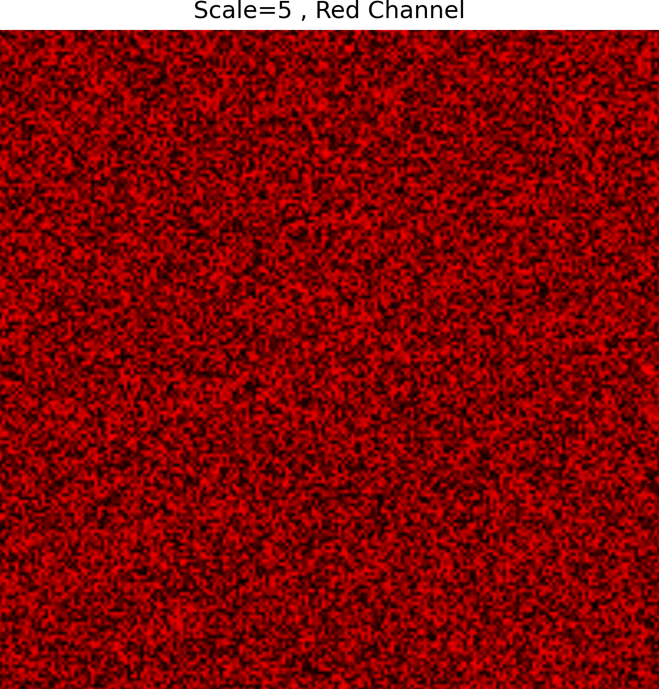
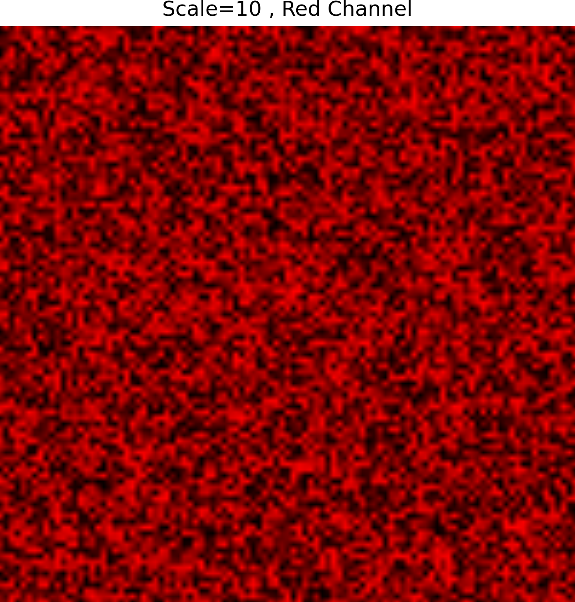
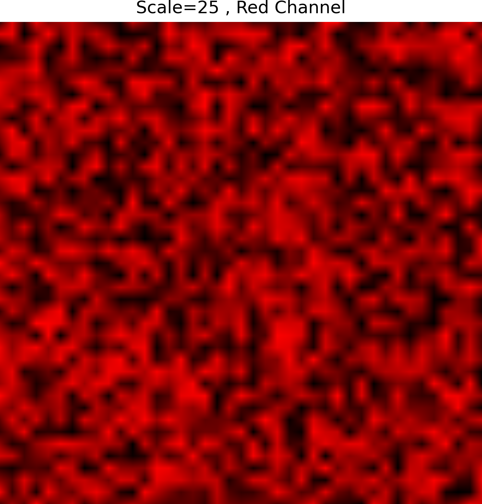
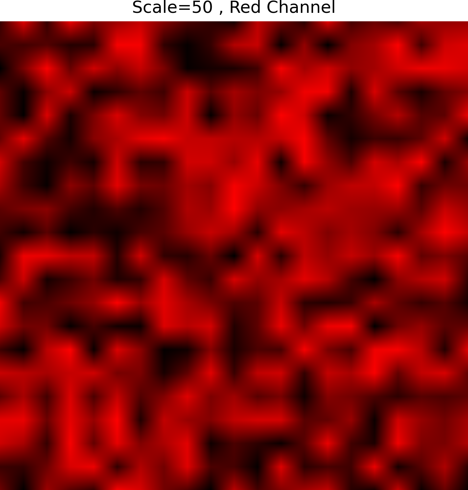
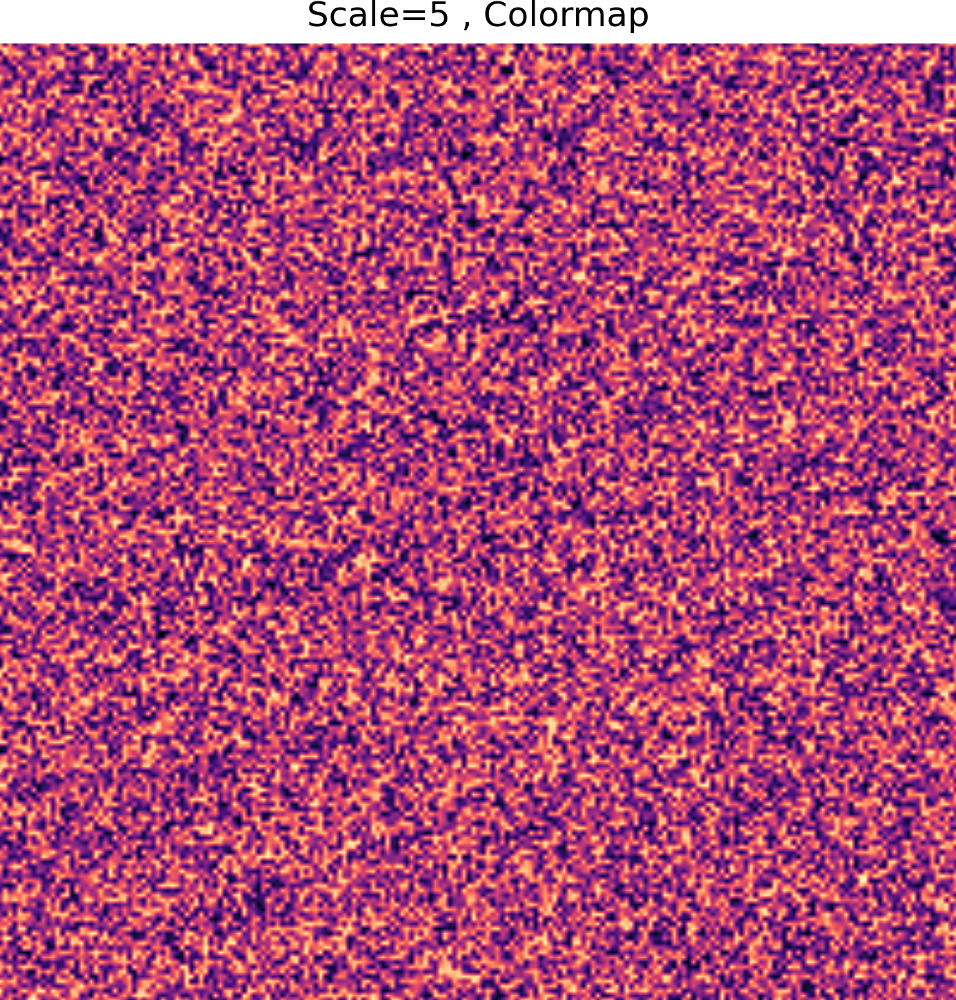
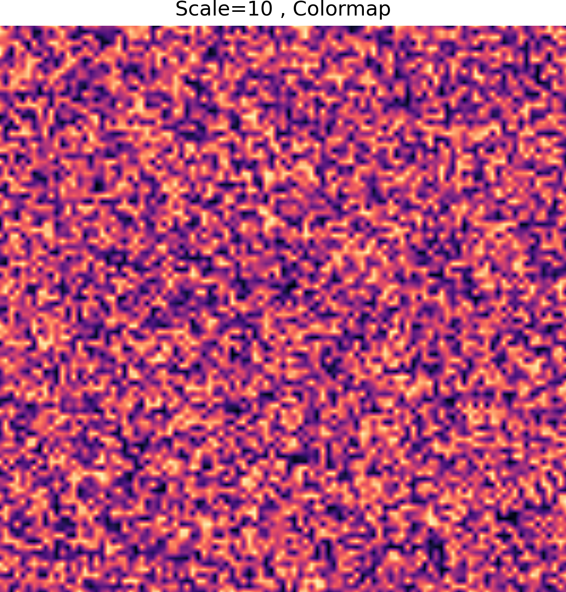
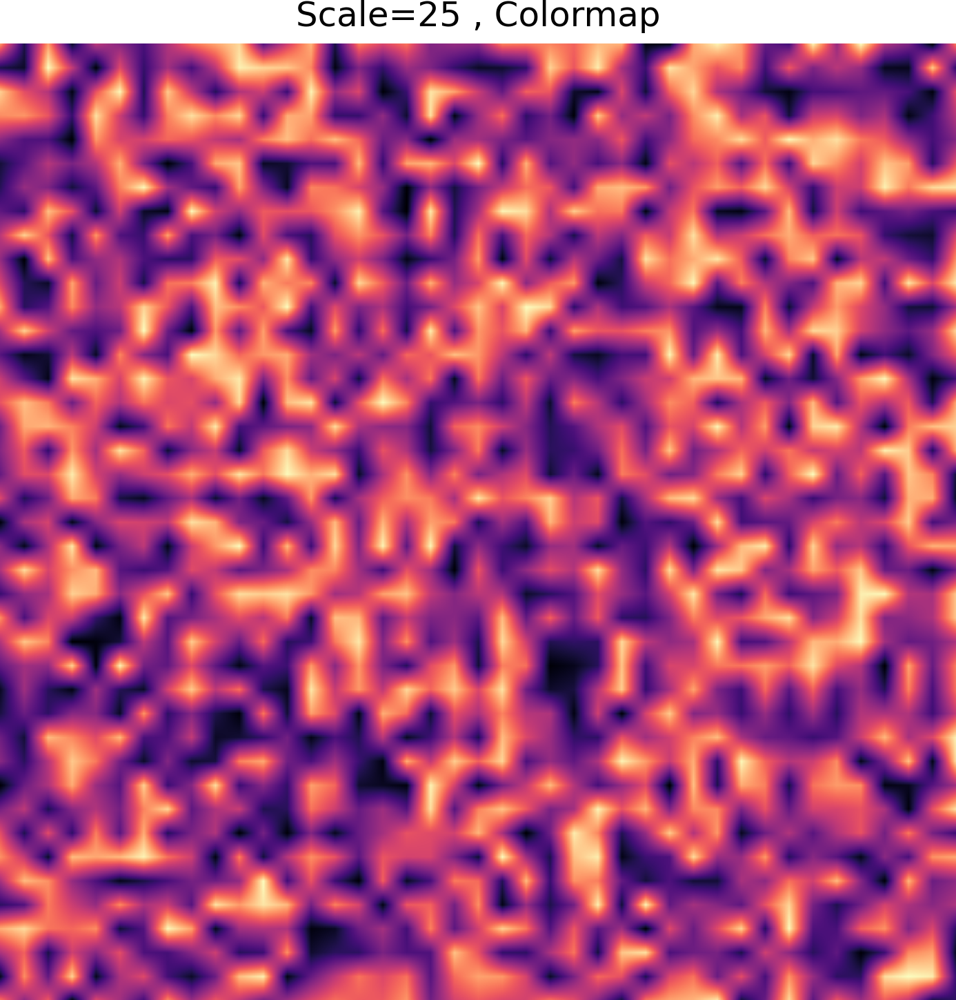
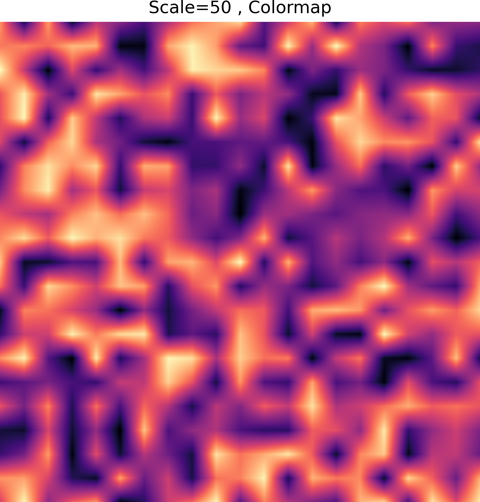

# Documentation for Assignment 1

## Table of Contents

- [Pseudo-Code](#pseudo-code)
- [Technical Explanation](#technical-explanation)
- [Results](#results)
- [References](#references)

---

## Pseudo‑Code

1. Initialize Variables
   - Set canvas dimensions (height, width)
   - Define random seed (seed)
   - Set scale value controlling noise roughness (scale)

2. Set Random Seed
   - Call np.random.seed(seed) for reproducibility

3. Define Vectorized Perlin‑like Noise Function
   - Create a coarse grid of random values
   - Generate full pixel coordinate arrays using np.meshgrid
   - Compute which coarse grid cell each pixel belongs to
   - Compute local offsets (tx, ty) inside each cell
   - Fetch the four surrounding corner values using NumPy indexing
   - Perform horizontal interpolation between left and right corners
   - Perform vertical interpolation between the two interpolated rows
   - Return the final 2D noise array

4. Generate and Normalize Noise
   - Call the Perlin‑like noise function
   - Normalize noise values to the range [0, 1]

5. Choose Visualization Mode
   - Option A (manual RGB):
       - Create a 3D array (height × width × 3)
       - Assign noise to the red channel
       - Set green and blue channels to zero
   - Option B (colormap):
       - Apply a Matplotlib colormap
       - Convert the 2D noise array into an RGBA image

6. Display Image
   - Create a Matplotlib figure
   - Display the selected RGB image using imshow()

7. Save Image
   - Build a filename including seed and scale
   - Save the figure to "images"

---

## Technical Explanation

This project generates a patterned image by transforming a 2D NumPy array using a vectorized Perlin‑like noise function. The code begins by defining the canvas dimensions, the random seed, and a scale parameter that controls the size and smoothness of the noise features. Setting the seed with np.random.seed() ensures that the output is reproducible.

The Perlin‑like noise function is vectorized, meaning it operates on entire arrays at once rather than looping over individual pixels. A coarse grid of random values is created, and np.meshgrid is used to generate full 2D arrays of pixel coordinates. For each pixel, the function determines which coarse‑grid cell it belongs to and computes its relative position inside that cell. The four surrounding corner values are retrieved using NumPy indexing, and linear interpolation is performed horizontally and vertically across the entire image. This produces a smooth noise field efficiently without explicit loops.

After generating the noise, the values are normalized to the range [0, 1] so they can be mapped cleanly to colors. The code supports two visualization modes. In the manual RGB mode, a 3‑channel array is created and the noise is assigned directly to the red channel, leaving the green and blue channels at zero. This demonstrates explicit control over RGB channels using NumPy. In the colormap mode, the normalized noise is passed through a Matplotlib colormap, which automatically converts the grayscale values into a colored image.

Finally, the selected image is displayed using plt.imshow() and saved. The filename includes both the seed and the scale value, making it easy to track how different parameters influence the resulting pattern.

---

## Results
<h3>Red Channel</h3>

<table>
  <tr>
    <td align="center">
       
      <strong>Scale 5</strong>
    </td>
    <td align="center">
       
      <strong>Scale 10</strong>
    </td>
    <td align="center">
       
      <strong>Scale 25</strong>
    </td>
    <td align="center">
       
      <strong>Scale 50</strong>
    </td>
  </tr>
</table>

<h3>Magma Colormap</h3>

<table>
  <tr>
    <td align="center">
       
      <strong>Scale 5</strong>
    </td>
    <td align="center">
       
      <strong>Scale 10</strong>
    </td>
    <td align="center">
       
      <strong>Scale 25</strong>
    </td>
    <td align="center">
       
      <strong>Scale 50</strong>
    </td>
  </tr>
</table>

---
## References

- Perlin noise implementation: [Garagefarm.net](https://garagefarm.net/blog/perlin-noise-implementation-procedural-generation-and-simplex-noise)
