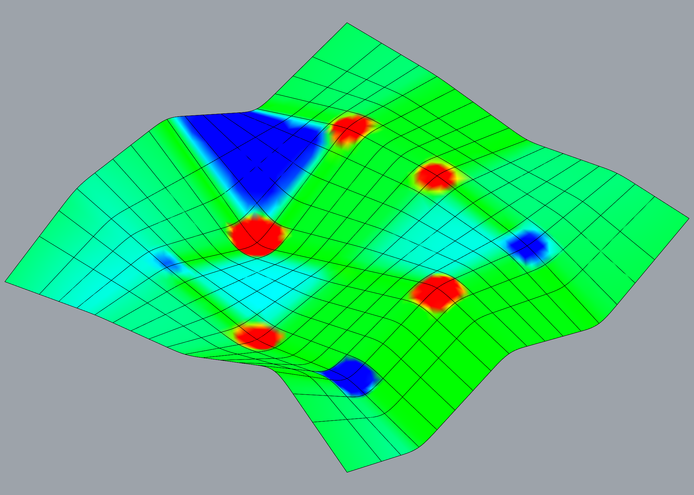
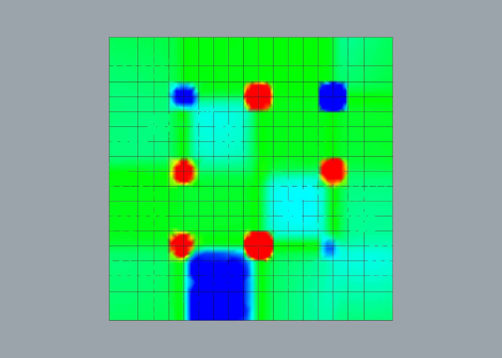

# Assignment 4: Agent-Based Modeling for Surface Panelization


---

## Objective

In this assignment, you will develop an **agent-based system for surface rationalization** using **Object-Oriented Programming (OOP)** in Python. Building on the surface you generated in Assignment 3 (or a comparable heightmap-driven surface), you will design agents that respond to geometric signals and collectively produce **panelization patterns**. The core idea is that agents move, interact, and make decisions based on how they sample the geometry, and their trajectories and interactions become the basis for a rationalized panelization of that surface.

Your implementation must incorporate **at least two types of geometric signals** (chosen from curvature, slope, vector fields, scalar fields, and spatial influences) when defining agent behavior. The primary outputs of this assignment are: (1) a rationalized panelization of your surface and (2) simulated agent trajectories and fields that you document and analyze.

---

## Repository Structure
```
Assignment4/
├── BRIEF.md                # Assignment handout (this file)
├── README.md               # Documentation with pseudo-code and explanations
├── TEMPLATE.md             # Minimal documentation template
├── agent_panelization.gh   # Your grasshopper definition
├── surface_generator.py    # Python script to generate a complex surface using a numpy array generated with a continuous function
├── agent_builder.py        # Python script used in defining and initializing agents
├── agent_simulator.py      # Python script used in simulating agent behaviors
├── (additional scripts)    # Any additional modules for field generation, panelization, analysis, or visualization
├── images/
│   └── (Output Images)
```
## Table of Contents

- [Project Overview](#project-overview)
- [Pseudo-Code](#pseudo-code)
- [Technical Explanation](#technical-explanation)
- [Design Variations](#design-variations)
- [Challenges and Solutions](#challenges-and-solutions)
- [AI Acknowledgments](#ai-acknowledgments)
- [References](#references)

---

## Project Overview
In this project I developed an agent-based panelization system in Grasshopper using three custom GhPython components: a surface builder, an agent builder, and an agent simulator. The simulation operates on a Rhino surface generated earlier in the course (derived from my Assignment 1 reworked heightmap-based terrain surface). Agents are initialized across this geometry and then step through time, responding to a set of geometric signals that influence their movement. Their trajectories are later used as the basis for tessellation and panel generation. The model runs interactively in Grasshopper, with persistent agent states stored using `scriptcontext.sticky`.

The system uses several geometric signals: local Gaussian curvature, inter-agent separation, repulsion from spatial obstacles, and a boundary proximity field derived from the surface’s UV domain. Each agent responds simultaneously to at least two signal categories:

Curvature field (scalar field): Agents compute the gradient of absolute Gaussian curvature and move toward regions where curvature changes most rapidly.

Spatial influences (distance-based signals): This includes separation (agents avoid neighbors) and repulsion (agents steer away from user-defined repulsor points).

Together, these signals determine the agent’s velocity, freezing behavior near boundaries, and the long-term flow patterns that emerge across the surface. For the final tessellation, the agent positions are fed into Grasshopper’s native Delaunay Mesh component, producing a panelization whose topology reflects the emergent agent distribution.

---

## Pseudo-Code

### Surface Generator
```
``surface_generator.py``

  perlin_noise(height, width, scale, seed) -> 2D array
    - Allocate random lattice using seed
    - For each sample in (height, width):
         derive grid cell (gx, gy)
         compute normalized local coords (tx, ty)
         bilinear-interpolate the 4 lattice values
    - Return 2D noise array

  normalize_noise(noise) -> normalized_noise
    - shift noise so min=0, max=1

  build_height_field(noise, amplitude) -> H
    - multiply noise by amplitude
    - return height array H

  build_point_grid(W, H, height_field) -> list[list Point3d]
    - for each i in X:
        for each j in Y:
           P[i][j] = Point3d(i, j, H[j][i])

  build_surface_from_points(point_grid, W, H) -> NurbsSurface
    - flatten grid
    - call NurbsSurface.CreateFromPoints(flat_pts, W, H, degU=3, degV=3)

  MAIN EXECUTION (Grasshopper Component)
    - read Width, Height, Scale, Seed, Amp
    - noise      = perlin_noise(Height, Width, Scale, Seed)
    - noise_norm = normalize_noise(noise)
    - H          = build_height_field(noise_norm, Amp)
    - pts        = build_point_grid(Width, Height, H)
    - surface    = build_surface_from_points(pts, Width, Height)
    - output: Surface, Pts
```


### Agent builder
```
  # ---------------------------------------------------------
  # 1. Agent Class Definition
  # ---------------------------------------------------------

  class Agent:
      attributes:
          position : Point3d
          velocity : Vector3d
          min_distance : placeholder (unused in builder)
          curvature_value : placeholder (unused in builder)
          repulsor_forces : placeholder list (unused in builder)
          id : unique integer ID

      constructor(position, velocity):
          store position and velocity
          initialize placeholder attributes (None or empty list)
          id = None

      initialize_state():
          (exists for expansion; unused in builder)
          pass


  # ---------------------------------------------------------
  # 2. Agent Factory: Create Grid of Agents on Surface
  # ---------------------------------------------------------

  build_agents(surface, div_u, div_v)
      inputs:
          surface : Rhino surface (NurbsSurface or BrepFace)
          div_u   : number of subdivisions in U
          div_v   : number of subdivisions in V

      outputs:
          agents : list of Agent objects
          points : list of Point3d locations used to generate agents

      logic:
          if surface is invalid OR divisions < 1:
              return empty lists

          read surface domains:
              dom_u = surface.Domain(0)
              dom_v = surface.Domain(1)

          initialize:
              agents = []
              points = []
              agent_id = 0

          FOR i from 0 → div_u:
              compute u parameter linearly across domain
              FOR j from 0 → div_v:
                  compute v parameter linearly across domain

                  point = surface.PointAt(u, v)
                  points.append(point)

                  velocity = Vector3d(0,0,0)

                  agent = Agent(point, velocity)
                  agent.id = agent_id
                  agent_id += 1

                  agents.append(agent)

          return agents, points


  # ---------------------------------------------------------
  # 3. Grasshopper Execution
  # ---------------------------------------------------------

  MAIN EXECUTION:
      Agents, Pts = build_agents(Srf, DivU, DivV)
      output Agents, Pts

```

### Agent Simulator
```
---------------------------------------------------------
1. Agent Class Definition
---------------------------------------------------------

class Agent:
    attributes:
        position : Point3d
        velocity : Vector3d
        frozen   : bool (used to stop motion near boundaries)

    constructor(position, velocity):
        store position
        store velocity
        frozen = False


---------------------------------------------------------
2. Utility Functions
---------------------------------------------------------

is_near_edge(surface, pt, threshold)
    logic:
        use surface.ClosestPoint(pt) → (success, u, v)
        get surface.Domain(0) and surface.Domain(1)
        return True if u or v lies within threshold of domain edges

clamp_to_surface(surface, pt) -> Point3d
    logic:
        evaluate ClosestPoint on surface
        return corresponding PointAt(u, v)

compute_separation(agent, agents, min_dist) -> Vector3d
    logic:
        initialize sum_vec = (0,0,0)
        for each neighbor in agents:
            skip if neighbor is agent
            compute 3D distance
            if distance < min_dist:
                compute normalized push-away vector
                add to sum_vec
        return sum_vec

compute_curvature_gradient(surface, pt, delta)
    logic:
        map pt to param coords (u, v)
        sample absolute Gaussian curvature at:
            (u, v)
            (u+delta, v)
            (u, v+delta)
        compute finite differences:
            dU = |K(u+δ,v)| - |K(u,v)|
            dV = |K(u,v+δ)| - |K(u,v)|
        compute 3D param-direction vectors:
            du_vec = normalized PointAt(u+δ,v) - PointAt(u,v)
            dv_vec = normalized PointAt(u,v+δ) - PointAt(u,v)
        return dU*du_vec + dV*dv_vec

compute_repulsion(agent, repulsor_points) -> Vector3d
    logic:
        sum inverse-distance push-away vectors from each repulsor point

compute_boundary_force(surface, pt, threshold)
    logic:
        map pt to (u, v)
        normalize u, v to [0,1]
        if near boundary (< threshold):
            compute direction toward param-center (0.5, 0.5)
            convert to 3D direction using small param-step vectors
        return boundary pull vector


---------------------------------------------------------
3. Sticky Memory and Reset Logic
---------------------------------------------------------

sticky_key = "AgentSimulator::sticky_agents"

RESET:
    if Reset is True:
        if input agents are provided:
            copy their positions and velocities
            freeze any agent near boundary
            store list in sc.sticky[sticky_key]
        else:
            randomly generate agents across surface
            freeze any near boundary
            store list in sc.sticky[sticky_key]


---------------------------------------------------------
4. Main Simulation Step
---------------------------------------------------------

INITIALIZATION:
    if sticky_key not in sc.sticky:
        sc.sticky[sticky_key] = []
    UpdatedAgents = sc.sticky[sticky_key]

SIMULATION STEP (when RunStep == True):
    for each agent in UpdatedAgents:
        if agent.frozen:
            continue

        compute forces:
            sep   = compute_separation(agent, UpdatedAgents, MinDistance)
            curv  = compute_curvature_gradient(surface, agent.position)
            rep   = compute_repulsion(agent, RepulsorPts)
            bound = compute_boundary_force(surface, agent.position)

        combine forces:
            move = sep*w_sep + curv*w_curv + rep*w_rep + bound*w_bound

        if move has non-zero magnitude:
            normalize move to direction vector
            agent.velocity = direction * StepSize
            new_pos = agent.position + agent.velocity

            if is_near_edge(surface, new_pos):
                agent.velocity = 0
                agent.frozen = True
            else:
                agent.position = clamp_to_surface(surface, new_pos)


---------------------------------------------------------
5. Grasshopper Execution
---------------------------------------------------------

MAIN EXECUTION:
    run reset logic if Reset == True
    if RunStep == True: execute simulation step
    UpdatedAgents = sc.sticky[sticky_key]
    Positions = list of agent.position for each agent
    output UpdatedAgents, Positions

```

---

## Technical Explanation

### 1. Overall Pipeline

The system is structured as a modular agent-based simulation for surface panelization. The pipeline consists of five stages:

1. Surface generation (surface_generator.py)
   A heightmap-based surface is generated using a Perlin-like noise function,
   producing a smooth 3D NURBS surface. This surface provides the spatial domain
   for agent movement.

2. Field / Signal Computation
   Several geometric signals are extracted directly from the surface:
     - Curvature field: computed as absolute Gaussian curvature sampled across the surface.
     - Distance-based signals: spatial relationships between agents and repulsor points.
   These signals are represented as either continuous scalar values (curvature)
   or computed dynamically per agent (distance to neighbors or obstacles).

3. Agent Initialization (agent_builder.py)
   Agents are initialized on a uniform UV grid across the surface. Each agent
   starts with zero velocity and a frozen flag, which prevents movement if they
   are near boundaries.

4. Simulation (agent_simulator.py)
   Agents iteratively update their positions according to local signals:
     - Separation from nearby agents
     - Attraction toward high-curvature regions
     - Repulsion from obstacles
     - Boundary constraints
   Forces are weighted and summed, producing a velocity vector for each step.
   Positions are clamped to the surface, and frozen agents are skipped.

5. Panelization / Geometry Output
   Agent trajectories are sampled and fed into Grasshopper’s native Delaunay mesh
   component. This generates a tessellated panel layout, where agent density and
   flow indirectly influence panel size and orientation.

---

### 2. Surface Generation and Fields

- Surface generation:
  The system reuses the heightmap-based surface concept from my reworked Assignment 1. A 2D noise array is scaled to 3D points, and a NURBS surface is created from the grid.

- Field computation:
  The primary field is absolute Gaussian curvature. Curvature is sampled at agent
  locations using a finite-difference approximation over small parametric offsets
  (Δu, Δv).
  Distance-based signals (separation and repulsion) are computed dynamically,
  based on Euclidean distances between agents and obstacles.

- Field representation:
  Curvature is sampled per agent rather than stored as a full grid array.
  UV coordinates (u,v) are directly used to evaluate curvature at the agent’s
  surface point.
  Distance-based signals are computed using the agent positions in 3D.

---

### 3. Geometric Signals and Agent Behaviors

- Curvature (scalar field):
  Agents compute the gradient of absolute Gaussian curvature and move toward
  regions of rapidly changing curvature. This encourages clustering along
  geometrically interesting areas and naturally increases panel density in
  high-curvature zones.

- Distance / Spatial Influences:
  - Separation: Agents repel from neighbors closer than a minimum distance,
    preventing clustering that is too dense.
  - Repulsion: Agents avoid user-defined obstacle points, steering trajectories
    away from these areas.

- Signal combination:
  Each agent computes a net movement vector:

    move = (sep * SeparationWeight) + 
           (curv * CurvatureWeight) + 
           (rep * RepulsionWeight) + 
           (bound * BoundaryWeight)

  This weighted sum produces a coherent motion field that balances attraction to
  curvature with avoidance behaviors.

---

### 4. Agent Life-Cycle and Interactions

- Life-cycle rules:
  Agents do not spawn or die dynamically in this version. They are persistent
  throughout the simulation, though their frozen state can temporarily stop
  movement near surface boundaries.

- Interactions:
  Agents influence each other via separation, ensuring evenly spaced trajectories.
  There is no alignment or cohesion, but repulsion from neighbors indirectly
  organizes the flow of agents and prevents clustering artifacts.

- Contribution to panelization:
  Inter-agent spacing and curvature-following behavior generate paths that are
  sampled to create vertices for the Delaunay mesh, producing panel boundaries
  that reflect local surface geometry and agent distribution.

---

### 5. Simulation and Panelization Strategy

- Simulation:
  - Controlled by the RunStep boolean, each step updates agent positions once.
  - Stopping criteria are user-driven (stop stepping manually or when agents
    reach boundaries).

- Panelization:
  - Trajectories are sampled as 3D points.
  - Grasshopper’s Delaunay mesh component uses these points to construct triangles,
    forming panels.
  - Denser agent clustering in high-curvature regions naturally generates smaller
    panels, while flat regions produce larger panels.
  - Orientation aligns indirectly with the flow of agents, reflecting both curvature
    gradients and repulsor avoidance paths.

---

### 6. Multi-Module Design

- Modular structure:
  - surface_generator.py: surface creation from a heightmap.
  - agent_builder.py: agent class and grid initialization.
  - agent_simulator.py: simulation loop, force computations, state updates.

- Rationale:
  Modular separation improves readability, allows independent testing, and
  makes the system extensible. For example, new signals or agent behaviors could
  be added in agent_simulator.py without modifying the builder or surface code.

- Optional extensions:
  - field_generator.py could precompute curvature or slope fields as full arrays
    for very large grids.
  - panelization.py could implement alternative mesh generation (quad, strip,
    or hybrid panels) based on agent trajectories.


---


## Design Variations

As the focus of this assignment  was on agent simulation i have chosen not to vary the generated surface (i promise it works and can be changed). The used parameters are as seen below:

| Parameter | Slider Value | Description                                 |
|-----------|--------------|---------------------------------------------|
| Width     | 20           | Number of points in the X direction         |
| Height    | 20           | Number of points in the Y direction         |
| Scale     | 5            | Grid spacing multiplier                     |
| Seed      | 42           | Random seed for noise or variation          |
| Amp       | 4.0          | Amplitude of height variation               |

The surface below is evaluated using Rhino’s native ``Curvature Analysis`` tool, with the display style set to Gaussian. In this visualization, red indicates regions of positive curvature, blue highlights areas of negative curvature, and green marks zones of zero curvature.

<table>
  <tr>
    <td align="center">
      <br>
      <strong>Isometric</strong>
    </td>
    <td align="center">
      <br>
      <strong>Top</strong>
    </td>
  </tr>
</table>


### Variation 1: [No repulsor point]
Expectation: As there is no repulsor points the points should move towards areas with a higher absolute curvature (blue and red zones). The minimum distance in this instance is 0.8 allowing the agents to bunch up.

<table>
  <tr>
    <td align="center">
      <br>
      <strong>Cuvature</strong>
    </td>
    <td align="center">
      <br>
      <strong>Delaunay Mesh</strong>
    </td>
  </tr>
</table>


| Parameter         | Value  | Description         |
|------------------|--------|----------------------|
| MinDistance          | 0.8    | The minium distance between agents               |
| **RepulsionWeight** | **0.00**   | **Influence of repulsor points on agent movement**   |
| CurvatureWeight  | 0.5    | Influence of surface curvature on agent behavior |
| SeparationWeight | 0.7    | Tendency of agents to maintain distance          |
| BoundaryWeight   | 0.6    | Influence of surface boundaries on agents        |
| StepSize         | 0.2    | Movement increment per simulation step           |

As expected the agents move to the zones with a higher absolute curvature.

---
### Variation 2: [Larger minimum distance]
Expectation: The minimum distance in this instance is 1.2 limiting the agents to ability to bunch up.

<table>
  <tr>
    <td align="center">
      <br>
      <strong>Cuvature</strong>
    </td>
    <td align="center">
      <br>
      <strong>Delaunay Mesh</strong>
    </td>
  </tr>
</table>


| Parameter         | Value  | Description         |
|------------------|--------|----------------------|
| **MinDistance**          | **1.2**    | **The minium distance between agents**               |
| RepulsionWeight  | 0.00   | Influence of repulsor points on agent movement   |
| CurvatureWeight  | 0.5    | Influence of surface curvature on agent behavior |
| SeparationWeight | 0.7    | Tendency of agents to maintain distance          |
| BoundaryWeight   | 0.6    | Influence of surface boundaries on agents        |
| StepSize         | 0.2    | Movement increment per simulation step           |

As expected the agents try to move to areas with a higher absolute curvature but are not allowed to bunch up together as close as the previous one 

---
### Variation 3: [Repulsor point]
Expectation: The introduction of a repulsor point should push away the agents from a specific zone. For this istance the repulsor is the black sphere on the surface.

<table>
  <tr>
    <td align="center">
      <br>
      <strong>Cuvature</strong>
    </td>
    <td align="center">
      <br>
      <strong>Delaunay Mesh</strong>
    </td>
  </tr>
</table>


<table>
  <tr>
    <td align="center">
      <br>
      <strong>Cuvature</strong>
    </td>
    <td align="center">
      <br>
      <strong>Delaunay Mesh</strong>
    </td>
  </tr>
</table>


| Parameter         | Value  | Description         |
|------------------|--------|----------------------|
| MinDistance          | 0.8    | The minium distance between agents|
| **RepulsionWeight** | **0.02**   | **Influence of repulsor points on agent movement**   |
| CurvatureWeight  | 0.5    | Influence of surface curvature on agent behavior |
| SeparationWeight | 0.7    | Tendency of agents to maintain distance          |
| BoundaryWeight   | 0.6    | Influence of surface boundaries on agents        |
| StepSize         | 0.2    | Movement increment per simulation step           |

It is clearly seen for both of the repulsor points that the agents are pushed away from it, however it can also be seen that the agents are stille searching towards areas with a higher curvature.


---

## AI Acknowledgments


### Agent builder ###
For the agent builder i promted both ChatGPT and Copilot with the following pseudo code to write an agent builder GhPython code in Rhino 8, and went with copilots translation:
```
Purpose: This code should build a grid of agents on a Rhino surface. Each agent starts at a surface point with zero velocity. The builder prepares them for later simulation.

# -- Imports -- #
import rhinoscriptsyntax as rs
import Rhino.Geometry as rg

# -- Agent Class -- #
class Agent:
    """Represents a single agent with position, velocity, and placeholders."""

    def __init__(self, position, velocity):
        # Store position (Point3d) and velocity (Vector3d)
        self.position = position
        self.velocity = velocity

        # Placeholders for simulation parameters (for use in agent simulator code)
        self.min_distance = None
        self.curvature_value = None
        self.repulsor_forces = []

        # Optional ID
        self.id = None

    def initialize_state(self):
        """Not used in builder, but exists for future expansion."""
        pass

# -- Factory Function: Build Agents from Surface -- #
def build_agents(surface, div_u, div_v):
    """
    Create agents on a UV grid across the surface.
    - surface: Rhino surface
    - div_u, div_v: number of divisions in U and V directions
    """

    # Handle invalid inputs
    if surface is None: return [], []
    if div_u < 1 or div_v < 1: return [], []

    agents = []
    points = []
    agent_id = 0

    # Get surface domains (U and V ranges)
    dom_u = surface.Domain(0)
    dom_v = surface.Domain(1)

    # Loop through grid
    for i in range(div_u + 1):
        u = dom_u.T0 + (i/div_u) * (dom_u.T1 - dom_u.T0)
        for j in range(div_v + 1):
            v = dom_v.T0 + (j/div_v) * (dom_v.T1 - dom_v.T0)

            # Create point on surface
            pt = surface.PointAt(u, v)
            points.append(pt)

            # Agent with zero velocity
            vel = rg.Vector3d(0,0,0)
            agent = Agent(pt, vel)
            agent.id = agent_id
            agent_id += 1

            agents.append(agent)

    return agents, points

# -- Outputs -- #
Agents, Pts = build_agents(Srf, DivU, DivV)

```

### Agent Simulator ###
For the agent simulator i also promted Copilot with the following pseudo code to write an agent builder GhPython code in Rhino 8 while it had the agent builder code referenced to make sure they worked together with the same variable names and so on:
```
# Purpose: Simulate agents on a surface with step-wise updates in a GhPython component in Rhino 8. Agents respond to: separation, absolute curvature gradients repulsor points, and boundary pull. State persists via sc.sticky.

# Imports
import Rhino.Geometry as rg
import random
import scriptcontext as sc

# Agent class
class Agent:
    # Holds 3D position, velocity, and frozen state
    def __init__(position: Point3d, velocity: Vector3d):
        self.position = position
        self.velocity = velocity
        self.frozen = False

# Utility functions
def is_near_edge(surface, pt, threshold=1e-3) -> bool:
    # ClosestPoint -> (success,u,v); compare to domain endpoints
    ...

def clamp_to_surface(surface, pt) -> Point3d:
    # Project arbitrary 3D point back to surface via ClosestPoint
    ...

def compute_separation(agent, agents, min_dist) -> Vector3d:
    # Sum of unit vectors pushing away from neighbors closer than min_dist
    ...

def compute_curvature_gradient(surface, pt, delta=0.01) -> Vector3d:
    # Sample Gaussian curvature at (u,v), (u+δ,v), (u,v+δ)
    # Use absolute curvature values: |K|
    # Compute finite differences dU = |K(u+δ,v)| - |K(u,v)|
    # and dV = |K(u,v+δ)| - |K(u,v)|
    # Map param-space deltas to 3D using normalized (PointAt(u+δ,v)-PointAt(u,v))
    # and (PointAt(u,v+δ)-PointAt(u,v)); return dU*du_vec + dV*dv_vec
    ...

def compute_repulsion(agent, repulsorPts) -> Vector3d:
    # Inverse-distance push away from each repulsor point
    ...

def compute_boundary_force(surface, pt, threshold=0.05) -> Vector3d:
    # If close to any param boundary (normalized distance < threshold),
    # pull toward the surface param center
    ...

# Sticky key
KEY = "AgentSimulator::sticky_agents"

# Reset
if Reset:
    # If input agents provided: copy positions/velocities, set frozen near edge
    # Else: seed random agents across surface, freeze those near edge
    sc.sticky[KEY] = new_agents

# Initialize storage
if KEY not in sc.sticky: sc.sticky[KEY] = []
UpdatedAgents = sc.sticky[KEY]

# Step update
if RunStep and UpdatedAgents:
    for agent in UpdatedAgents:
        if agent.frozen: continue
        sep = compute_separation(agent, UpdatedAgents, MinDistance)
        curv = compute_curvature_gradient(surface, agent.position)
        rep = compute_repulsion(agent, RepulsorPts)
        bound = compute_boundary_force(surface, agent.position)

        move = sep*w_sep + curv*w_curv + rep*w_rep + bound*w_bound
        if |move| > 0:
            move_hat = move / |move|
            agent.velocity = move_hat * StepSize
            new_pos = agent.position + agent.velocity
            if is_near_edge(surface, new_pos):
                agent.velocity = 0; agent.frozen = False  # freeze or stop velocity
            else:
                agent.position = clamp_to_surface(surface, new_pos)

# Outputs
UpdatedAgents = sc.sticky[KEY]
Positions = [a.position for a in UpdatedAgents]

```
---